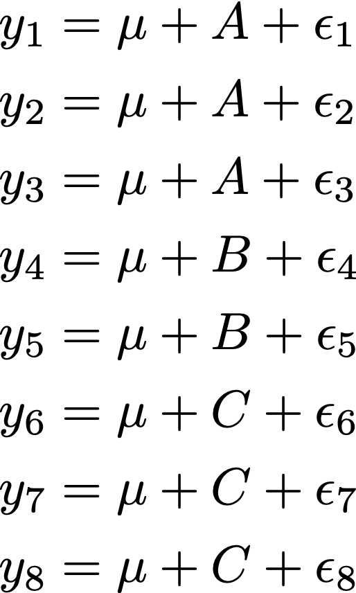
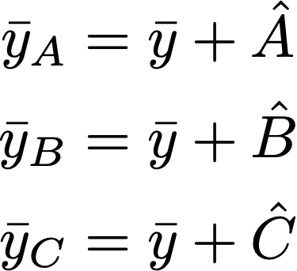
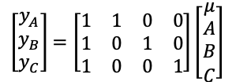
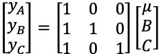
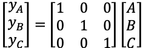
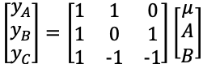

# Factor coding

`factor` is R's name for a categorical variable. Let's see an example. The `chickwts` data set is built into R, and records the results of a 1948 experiment where chicks were fed on different diets, and their weights were measured in grams at six weeks of age.

```{r}
# load the chickwts dataset and look at the top rows
data( chickwts )
head( chickwts )

# look at the feed variable - it's a factor
chickwts$feed

# make a boxplot of weight vs. feed
boxplot( weight ~ feed, data=chickwts )
```


There are six different types of feed: casein, horsebean, linseed, meatmeal, soybean, and sunflower. Now see what happens when I fit a linear model to this data:

```{r}
# create a linear model using the default coding, look at its summary
lm_default = lm( weight ~ feed, data=chickwts )
summary( lm_default )
```
The casein feed isn't shown in the results! And most of the feed types that are shown would give the chicks negative weights, which is clearly absurd. What gives?!
 
## How factors are coded in a model
 
The short answer is that the intercept here is actually the average weight of chicks on the casein feed, and everything else is the difference from casein. So based on the first two lines of the result table, chicks on casein feed weigh 323 grams on average, and those on the horsebean feed weigh 163 grams *less than that*, or 160 grams. Those numbers shold make sense based on the boxplot.

But why are the results reported in such a weird way?
 
### The linear algebra explanation
Imagine that your factor variable has three levels, and call them A, B, and C. You're estimating how a continuous variable (like chick weight) depends on the factor level (like chick feed). You typically use an intercept to represent the overall average weight (aka the "grand mean"), so that you can then test whether any factor levels are different from average. This leads to a model where the grand mean $\mu$ and the factor levels $A$, $B$, and $C$ represent the average weights, with some random noise added in, too. That's written like this: 



This system of equations can't be solved (too many unknowns) so we work with the average of each group (A, B, C). To do so, we assume that the average error is zero within each group, so the group means can each be written as the sum of the grand mean and the group effect: 



Now we are down to three equations with four unknowns - close but not good enough! Another way to write that same system of equations is this, which will be a bit more productive going forward:



We have to reduce the number of unknowns by one. We do so by introducing a constraint on the coefficients, which allows us to remove a column from the "design matrix" in the figure above.

## The default

By default, R will drop the column that represents the first level of each factor. This is called a "treatment contrast" (more on contrasts later) or the set-to-zero constraint (because it is like constraining the $A$ effect to be zero):



Now we'll look back at the model summary table, where the "first" level of the factor (casein) doesn't appear. That's because it is set to zero in order to estimate the model. Since casein is swept into the intercept, we find the average weight of a chick fed on horsebeans by adding the `(Intercept)` and `feedhorsebean` coefficients, as you would predict from the design matrix of the set-to-zero constraint.

# Constraints

There are only a few constraints (R calls them "contrasts") to know:


## `contr.treatment`
The default. Sets a level of the factor to have zero effect. You saw an example of the design matrix just a moment ago. Take a look at the design matrix according to R:

```{r}
# look at the default coding of feed
contrasts( chickwts$feed )
```


## "One-hot" encoding
You can do this yourself by removing the intercept. You gain interpretability, but now the significance level is telling you whether the factor level mean is different from zero (you usually want to know if it is different from average).



```{r}
# fit a version of the model for chick weight that has no intercept
lm_nointercept = lm( weight ~ feed - 1, data=chickwts )
summary( lm_nointercept )
```

## `contr.sum`: sum-to-zero constraints
With sum-to-zero constraint, the factor level effects must add up to zero. Thus, the intercept represents the average of the fitted factor effects, and the final level is calculated by adding together all of the shown estimates.




You can set the contrasts as an attribute of the data or pass it to the `lm()` function.


```{r}
# set the feed variable to use sum-to-zero constraint
contrasts( chickwts$feed ) = contr.sum
chickwts$feed

# re-fit the linear model 
lm_stz = lm(weight ~ feed, data=chickwts)
summary( lm_stz )

# calculate the missing coefficient
sum( coef(lm_stz)[[1]] - sum( coef(lm_stz)[2:6]) )
```

## `contr.poly`
This one is for ordered factors, and gets a bit more complicated. Beyond today's scope.

## `contr.helmert` and `contr.SAS`
Used in special situations that I wont get into, but you can infer their workings by looking at how they set up the design matrix for our example:

```{r}
# set the helmert contrast and look at its design
contrasts( chickwts$feed ) = contr.helmert
chickwts$feed
```

```{r}
# set feed to use the SAS contrast and look at its design
contrasts( chickwts$feed ) = contr.SAS
chickwts$feed
```


# `emmeans`
Rather than think at all about design matrices, you can use the `emmeans` package to extract fitted factor levels and differences from your model. This works with a lot of modeling packages, including `lme4` and `brms`.

```{r}
# import the package emmeans
library( "emmeans" )
```

## Simplest case: single factor variable
We can see the basic functionality even with an ultra-simple model like the ones we've made for chicken feed:

```{r}
# look at the mean fits for the default model
emmeans( lm_default, specs= ~feed )
```

Now the factor coding doesn't matter - we get the same result for the model with no intercept and the one using a sum-to-zero constraint:

```{r}
# look at the mean fits for the no intercept model
emmeans( lm_nointercept, specs= ~feed )

# look at the mean fits for the sum-to-zero model
emmeans( lm_stz, specs= ~feed )
```

A slightly more complex result comes when you look at differences between levels:

```{r}
# use emmeans to calculate differences between feed levels
emmeans( lm_default, specs= pairwise ~ feed )
```


## A slightly more complex model

In order to illustrate a couple other features of `emmeans`, we must have a more complex model. Here, I'll use the `mtcars` data set, which contains various measurements of cars by *Motor Trend* magazine from 1974. All of the measurements are numeric, but I will recode a few as factors: number of cylinders (`cyl`), number of drive gears (`gear`), and whether the transmission is manual or automatic (`am`). My output will be miles per gallon (`mpg`), and I'll also use cylinder displacement (`disp`) as a non-factor input

```{r}
# load the mtcars data
data( mtcars )

# code cyl, gear, and am as factors:
mtcars$cyl = as.factor( mtcars$cyl )
mtcars$am = as.factor( mtcars$am )

# fit a model for mpg using cyl*disp*am
lm_mpg = lm( mpg ~ cyl*disp*am, data=mtcars )

# show the model summary
summary( lm_mpg )
```


This model allows illustration of some other features of emmeans. For instance, how to stratify results based on another factor, and how to calculate model slopes at different levels of an interaction:

```{r}
# look at mileage for the different cylinder counts,
# but consider auto and manual transmission carss separately:
emmeans( lm_mpg, specs = ~cyl|am )

# calculate the slope of disp at different cyl, am levels:
emtrends( lm_mpg, specs = ~ cyl|am, var="disp")
```

And there's a lot more to `emmeans` than that, but we have to stop here.


